# Paper RTS

> 一款結合聚落生存、資源管理、基地建設與單位微操的 2.5D 像素風即時戰略遊戲。

**Godot 4 · GDScript · 2.5D RTS · Pixel Art**

> 🟡 開發中：核心玩法系統已可運作與驗證；正式可下載 Demo 與完整美術內容持續製作中。

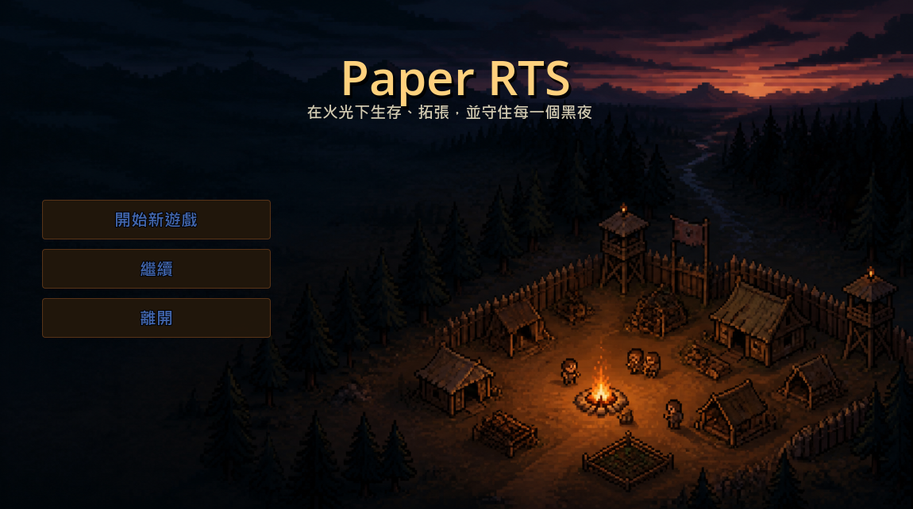

> 此 repository 作為 Paper RTS 的公開展示頁。可遊玩的 Demo 正在製作中，後續將隨開發進度持續更新遊戲畫面、功能展示與下載資訊。

---

## 遊戲介紹

Paper RTS 是一款單機即時戰略遊戲。

玩家將從小型營地開始，指揮村民採集資源、建造設施、訓練軍隊、研究科技，並在夜間抵禦敵人。隨著聚落發展，玩家可以派出遠征隊探索周邊地圖，取得新資源，逐步解鎖更高階的建築、科技與兵種。

遊戲將營地生存的資源壓力，結合即時戰略遊戲的單位操作與防守戰鬥。

## 遊戲展示

**▶ [觀看單位移動與戰鬥影片](docs/media/移動與戰鬥.mp4)**

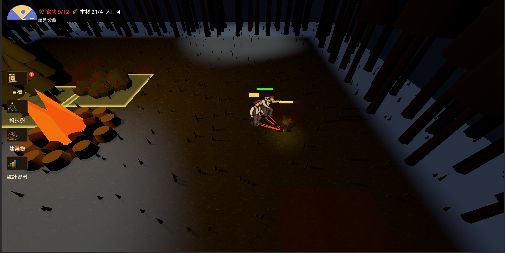

---

## 核心玩法

### 指揮單位

框選、多選、隊形移動、攻擊與駐紮，讓玩家能即時調度營地中的村民與軍隊。

| 單位框選 | 移動路徑與指令回饋 |
| --- | --- |
| 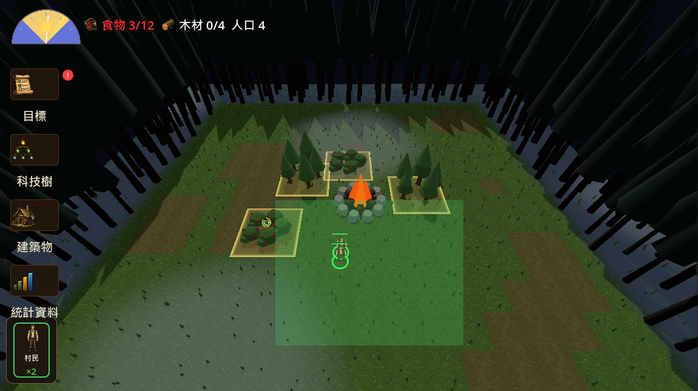 | 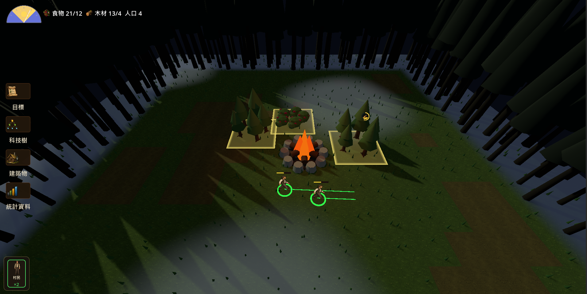 |

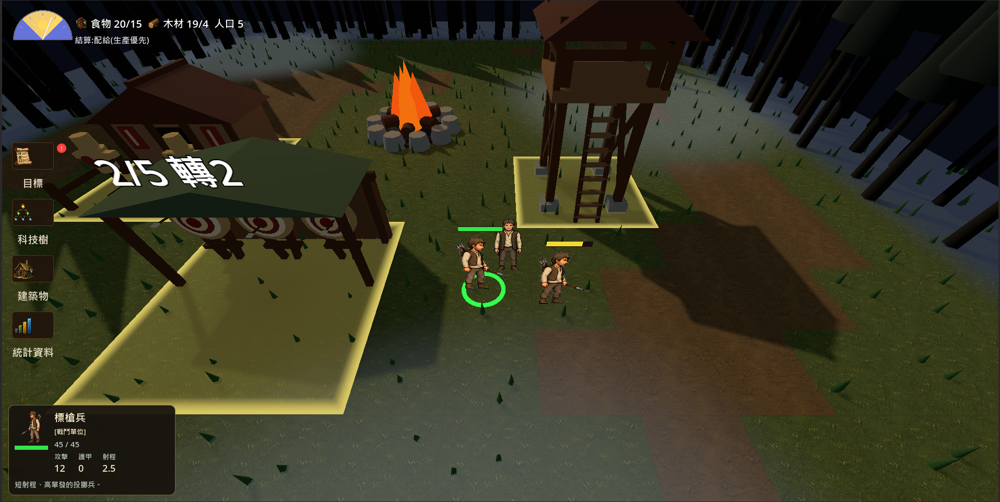

### 建立營地與資源分工

建造支援設施與生產建築，安排單位投入不同資源點，維持聚落的食物與材料供應。

| 建築與瞭望塔 | 資源採集 |
| --- | --- |
| 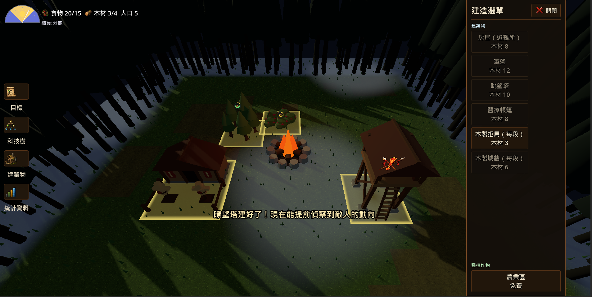 | 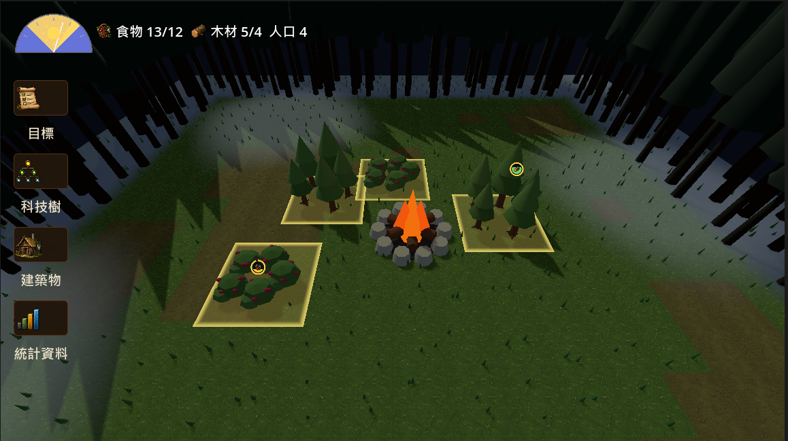 |

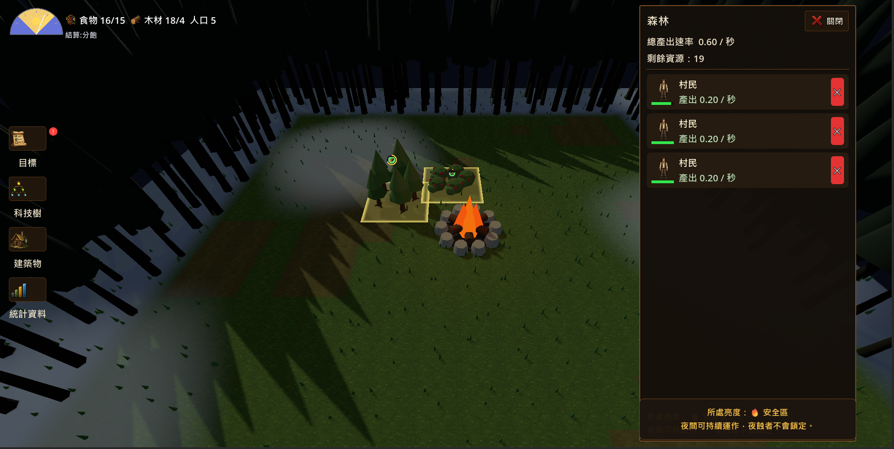

### 訓練與強化軍隊

透過軍事建築訓練近戰與遠程單位，逐步建立能夠抵禦敵襲的防守力量。

| 近戰單位訓練 | 遠程單位訓練 |
| --- | --- |
| 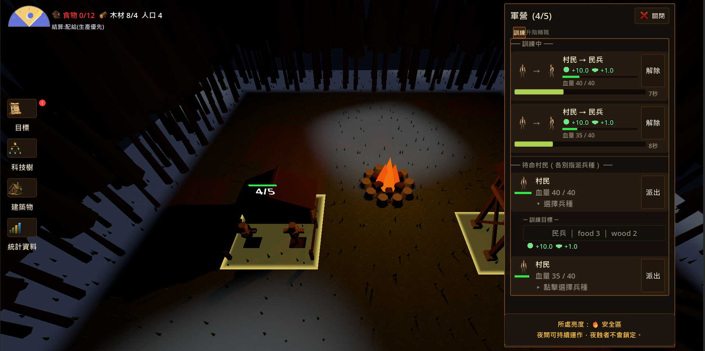 | 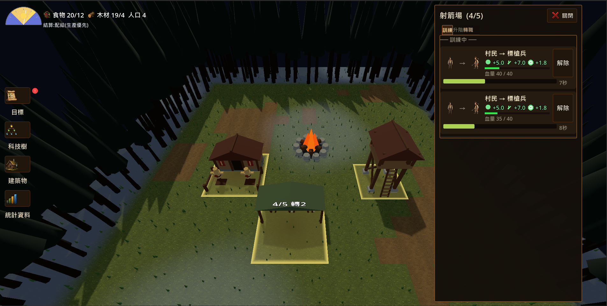 |

### 生存壓力與夜間防守

日夜變化會帶來不同的營地壓力；玩家需管理聚落、接納流浪者，並準備應對夜晚的威脅。

| 夜晚降臨 | 流浪者前來 |
| --- | --- |
| 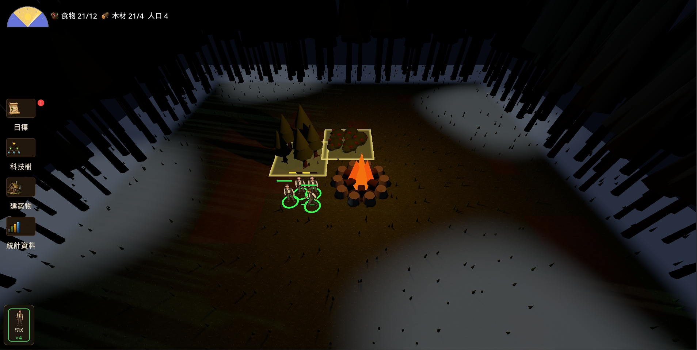 | 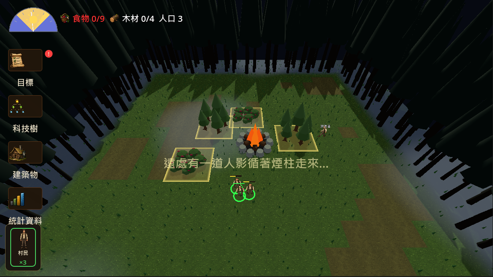 |

### 科技與發展

研究科技以拓展聚落能力、資源利用與軍事選擇。

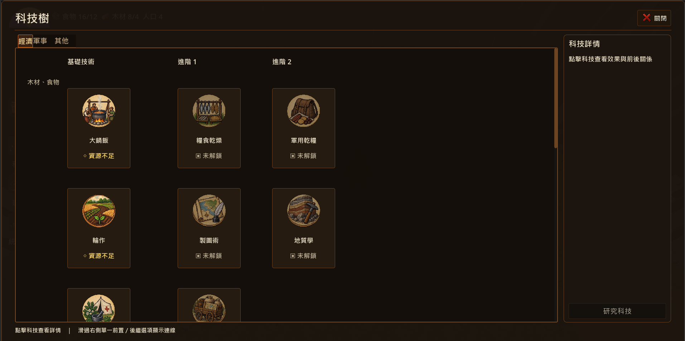

---

## 當前開發進度

### 已完成的核心內容

- 即時單位操作、框選、多單位隊形移動與戰鬥。
- 基地建造、資源採集、駐紮、生產與兵種升級。
- 日夜循環、食物分配、飢餓影響與人口成長。
- 科技研究、地圖探索、遠征與區域擴張。
- 敵人波次、夜間防守、村民避難與警報。
- 存檔與讀檔，以及主要遊戲流程的自動化驗證。

### 製作中

- 可下載的公開 Demo。
- 完整像素美術、角色動畫與介面呈現。
- 數值平衡、教學引導與整體遊戲節奏。
- 後期資源、科技、兵種與地圖內容。

---

## 未來製作方向

- 擴充兵種、敵人類型、科技路線與戰術選擇。
- 補完資源加工與後期經濟系統。
- 強化遠征、探索事件與地圖擴張目標。
- 完成季節與環境視覺變化。
- 發布可下載 Demo，持續根據玩家回饋調整平衡。

---

## AI 協作方式

本專案由開發者與 AI Coding Agent 協作開發。

開發者負責規劃遊戲方向、玩法規則與功能目標；AI 協助分析既有系統、實作功能、進行測試與整理文件。每次修改都會經過檢查與驗證，確保新功能能整合至現有遊戲系統。

這個協作模式讓開發流程能更快迭代，同時保有清楚的設計方向與品質控管。

---

## 技術概覽

- Godot 4 / GDScript
- 3D 世界搭配 2D 像素角色的 2.5D 表現
- 即時多單位操作與群體移動
- 資料驅動的單位、建築、科技與資源系統
- 自動化測試與存檔／讀檔支援

---

## 作品狀態

此 repository 用於展示 Paper RTS 的遊戲方向、已實作的核心功能與目前開發進度。可遊玩的 Demo 正在製作中，後續將持續更新展示內容與下載資訊。
